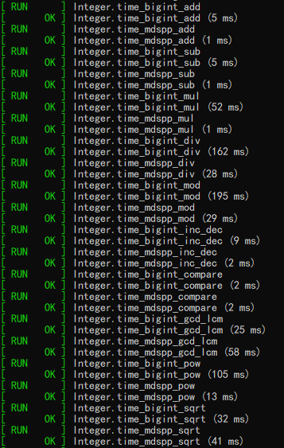
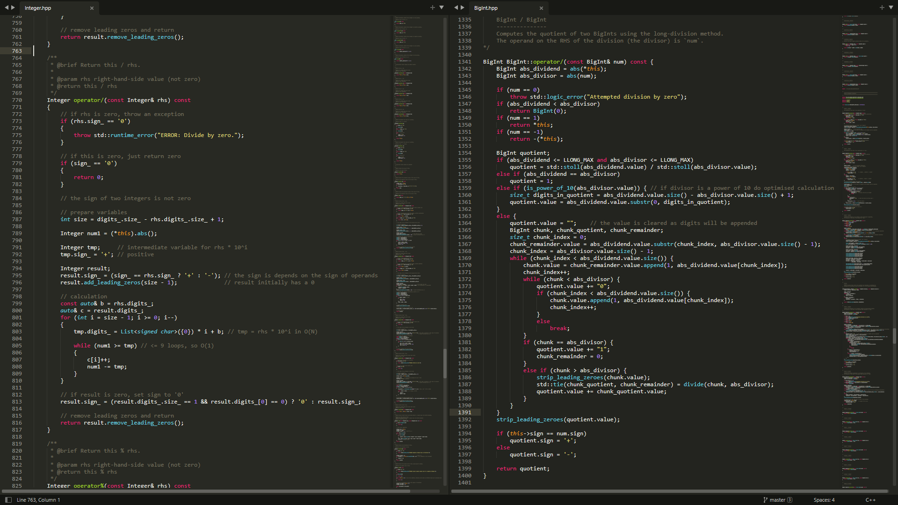

### mdspp::Integer vs BigInt

这里我简单比较一下GitHub上一个有三百多star的大整数类 [BigInt](https://github.com/faheel/BigInt) 和我写的大整数类 [mdspp](https://github.com/chen-qingyu/MDSPP)::Integer

 

从**性能**，**易用性**，**源码行数**和**源码整洁度**来比较

#### 性能：综合来看 mdspp::Integer 更快

- BigInt 的构造和底层用的是 std::string ，而 mdspp::Integer 用的是我自己写的容器库：构造是 mdspp::String ，底层是 mdspp::List
- 测试代码： [TestTime.cpp](./TestTime.cpp)
- 这个测试只是粗略的定性，大概对比一下速度。详细的定量分析，欢迎有兴趣的朋友帮我测试
- 测试日期： 2023.03.02 两个都是最新版

#### 易用性：差不多

| All functions     | mdspp::Integer | BigInt |
| ----------------- | -------------- | ------ |
| `+ - * / %`       | `yes`          | `yes`  |
| `+= -= *= /= %=`  | `yes`          | `yes`  |
| `+ - (unary)`     | `yes`          | `yes`  |
| `abs`             | `yes`          | `yes`  |
| `gcd lcm`         | `yes`          | `yes`  |
| `== != < <= > >=` | `yes`          | `yes`  |
| `pow`             | `yes`          | `yes`  |
| `++ --`           | `yes`          | `yes`  |
| `digits`          | `yes`          | `no`   |
| `factorial`       | `yes`          | `no`   |
| `sqrt`            | `yes`          | `yes`  |
| `>> << (IO)`      | `yes`          | `yes`  |
| `random`          | `no`           | `yes`  |

#### 源码行数：mdspp::Integer 几乎只有 BigInt 的一半

- mdspp::Integer: 1004 行
- BigInt: 1946 行

#### 源码整洁度：截取几个函数对比如图，请自行感受

#### 总结

mdspp::Integer 的性能综合来看更快，同时易用性和BigInt差不多，而源码行数只有BigInt的几乎一半，并且代码也更加整洁。

BigInt 只是这一个类就算一个项目，而我的 MDSPP 里像这样的类，一共七个： List, Set, Map, Integer, String, Tuple, Deque.

当然，那个库在我开始开发这个类的初期阶段也给了一定的帮助（我想说青出于蓝而胜于蓝）。

再回到文章开头，看那两个截图，一个300多个star，一个0个star……

一方面是因为那个项目存在的时间比这个久，MDSPP是今年才开始正式开发的（虽然早就计划了半年之久），另一方面是因为我没有怎么宣传，所以我现在就要好好宣传了：大家快去给我的项目点star吧！

[MDSPP: MineDataStructure++. 像Python一样好用的C++容器库 (github.com)](https://github.com/chen-qingyu/MDSPP)

[MDSPP: MineDataStructure++. 像Python一样好用的C++容器库 (gitee.com)](https://gitee.com/ChobitsY/mdspp)
